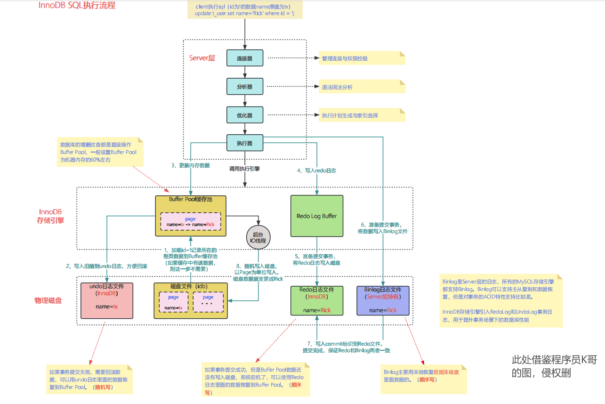

# Update语句的具体执行流程
我们知道 MySQL 主要有 Server 层和引擎层，Update 语句主要在引擎层面进行操作，引擎层由 Server 层的执行器来进行具体执行调用的。
## 文字描述：
假设现在有一条语句是：update user set name = 'yehuo' where id = 1; 

- 首先它会去引擎层的 Buffer Pool 内查找 id = 1 的这一行数据页是否存在。
  - 如果 id = 1 的数据在 Buffer Pool 中存在，就直接返回给执行器进行更新。
  - 如果 Buffer Pool 中不存在此数据页，则会从磁盘中读取 id = 1 的数据写入 Buffer Pool 中，再返回给执行器。
- 执行器拿到数据的记录后会判断更新前后的数据的记录是否一致。
  - 如果一致，则不进行后续更新流程。
  - 如果不一致就把更新前后数据的记录当作参数传给 InnoDB 层，让 InnoDB 真正的执行更新记录的操作。
- 开启事务，首先需要把 Buffer Pool 中 id = 1 的**脏记录**给记录到 Undo Log 中，用于在事务更新失败时进行数据的回滚。
- Undo Log 记录成功后，此时执行器对 Buffer Pool 内的数据页进行更新操作，更新成功后。
- 会将更新后的数据记录写入到 Redo Log Buffer，写入成功后会进行事务的准备提交操作 -> 将 Redo Log 日志写出磁盘，这里涉及到两阶段提交（Redo Log and Binary Log）。
- 当 Redo Log 成功写入到磁盘文件里的 Redo Log 文件里后，执行器会将数据写入到 Bin Log 日志里，进行事务准备提交工作，然后修改 RedoLog 日志的 prepare 标识为 commit 则代表事务提交成功。
## 流程图：

